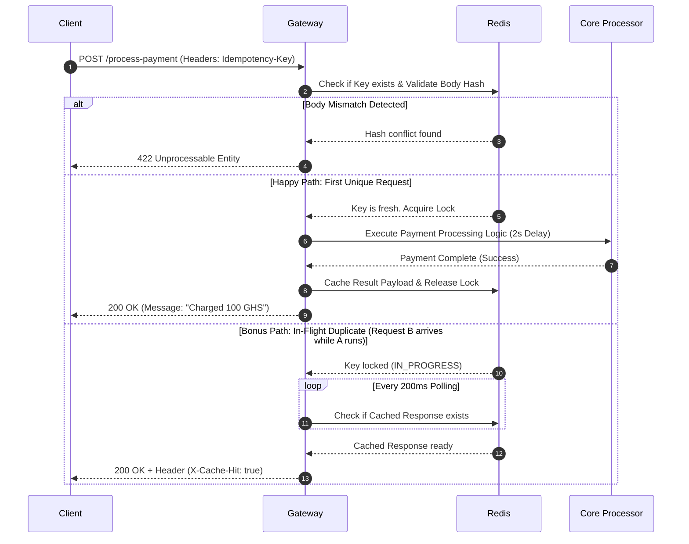

# FinSafe Idempotency Gateway (The "Pay-Once" Protocol)

This repository contains a production-grade backend Idempotency Middleware implementation engineered for **FinSafe Transactions Ltd.** to eradicate accidental double-charging caused by client retries and network timeouts.

---

## 1. System Architecture Diagram

Below is the execution sequence flow illustrating how incoming initial requests, concurrent in-flight retries, and mismatched body fraud spikes are intercepted and processed.

## 2. Setup & Installation Instructions

Prerequisites
Node.js (v16+)

Docker Desktop (with Virtualization enabled)

Local Launch Steps
Clone your Forked Repository:

`Bash`
git clone <your-forked-repo-url>
cd Idempotency-Gateway
Install Dependencies:

`Bash`
npm install
Start the Redis Docker Container:

Bash
docker run -d --name finsafe-redis -p 6379:6379 redis
Boot Up the Application Server:

`Bash`
node src/app.js
Execute Concurrency Verification Suite:
In a separate terminal, run:

`Bash`
node tests/simulate-traffic.js 3. API Documentation
Process Payment Endpoint
Securely manages mutating payment executions through single-shot validation.

URL: /process-payment

Method: POST

Headers:

Content-Type: application/json

Idempotency-Key: <UUIDv4>

Example Payload Request Body
JSON
{
"amount": 100,
"currency": "GHS"
}
Example Success Response (200 OK)
JSON
{
"status": "SUCCESS",
"message": "Charged 100 GHS",
"processedAt": "2026-06-24T00:05:00.000Z"
}
Example Duplicate Replayed Response (200 OK)
Includes Header: X-Cache-Hit: true

JSON
{
"status": "SUCCESS",
"message": "Charged 100 GHS",
"processedAt": "2026-06-24T00:05:00.000Z"
}
Example Tampered Body Error Response (422 Unprocessable Entity)
JSON
{
"error": "Unprocessable Entity",
"message": "Idempotency key already used for a different request body."

} 4. Design Decisions & "Developer's Choice" Highlight
Architecture Choices
Atomic Distributed Locking: Built utilizing Redis native command abstractions (SET key value NX EX). This guarantees that concurrency safety expands across multi-node auto-scaling clusters, completely eliminating application-level memory leaking risks.

Smart Polling Retry Mechanism: Implemented an asynchronous polling sleep engine to gracefully resolve concurrent multi-network spikes. Rather than flatly dropping in-flight duplicates with harsh transaction conflicts, retry clients organically hold connections open until the primary processor concludes, matching optimal financial transaction parameters.

The Developer's Choice Integration: Multi-Layer Fingerprint Mismatch Guard
Why it was added: Simple key matching leaves platforms vulnerable to accidental key collisions or malicious client reuse attacks (e.g., trying to clear a $500 transfer using an old token generated for a $10 invoice).

Implementation details: The gateway pairs the incoming header with a deterministic SHA-256 binary hash fingerprint generated directly from the immutable parameters within the request body. If keys align but structural content shifts, the application blocks execution, throwing a 422 Unprocessable Entity error to preserve underlying data ledger integrity.
