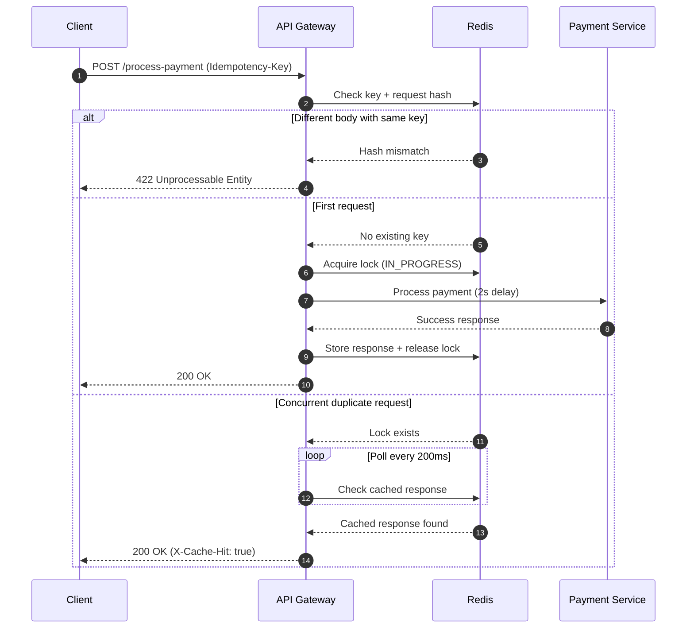

# FinSafe Idempotency Gateway (Pay-Once Protocol)

A backend system that prevents double-charging by enforcing request idempotency using Redis-based caching, locking, and request fingerprinting.

---

## 1. System Architecture Diagram

Below is the execution sequence flow illustrating how incoming initial requests, concurrent in-flight retries, and mismatched body fraud spikes are intercepted and processed.



## 2. Setup & Installation Instructions

Prerequisites

- Node.js (v16+)

- Docker Desktop (with Virtualization enabled)

### 1. Clone repository

```bash
git clone <your-repo-url>
cd Idempotency-Gateway
```

### 2. Install Dependencies:

```bash
npm install
```

### 3. Start Redis

```bash
docker run -d --name finsafe-redis -p 6379:6379 redis
```

### 4. Boot Up the Application Server:

```bash
npm run dev
```

### 5. Run test suite

```bash
npm test
```

## 3. API Documentation

**POST /process-payment**

Processes a payment request with idempotency protection.

**Headers:**

- Content-Type: application/json

- Idempotency-Key: <UUID>

**Request Body Object**

```json
{
  "accountNo": "ACC-98765-XYZ",
  "amount": 250.0,
  "currency": "GHS"
}
```

**Initial Success Response (200 OK)**

```json
{
  "status": "SUCCESS",
  "message": "Charged 250 GHS",
  "processedAt": "2026-06-24T00:05:00.000Z"
}
```

**Subsequent Cached Response (200 OK):**

Header:

X-Cache-Hit: true

Returns the identical JSON payload body generated by the original successful transaction.

**Invalid Reuse (422)**

Returned instantly when an identical key is matched against modified body parameters.

```json
{
  "error": "Unprocessable Entity",
  "message": "Idempotency key already used for a different request body."
}
```

## 4. Design Decisions

### 4.1 Redis Locking

**Uses SET key value NX EX**
Prevents duplicate execution during concurrent requests
Ensures only one payment runs per key

### 4.2 Request Fingerprinting

**SHA-256 hash of request body**
Stored under meta:<idempotency-key>
Detects payload tampering or reuse conflicts

### 4.3 Response Caching

**Final response stored under:**
response:<key>
TTL-based expiry (default 24h)
Enables instant replay of duplicate requests

### 4.4 In-Flight Protection

**Polling loop checks:**
Enforces an asynchronous wait/polling loop strategy that monitors the state of IN_PROGRESS operations at a steady 200ms checking resolution interval, preventing race conditions.

## 5. Validation Results

**Concurrent Request Test**

```bash
R==================================================
   FINSAFE IDEMPOTENCY PROTOCOL VERIFICATION SUITE
==================================================

--- STAGE 1: Simulating Concurrent Traffic Spike ---

 [Request A - Initial] Dispatched at 2026-06-24T18:25:44.808Z
 [Request B - Concurrent Duplicate] Dispatched at 2026-06-24T18:25:44.919Z
 [Request A - Initial] Response Received
   Status: 200
   Duration: 2032ms
   Cache Hit: false
 [Request B - Concurrent Duplicate] Response Received
   Status: 200
   Duration: 2123ms
   Cache Hit: false

--- STAGE 2: Simulating Historic Retry (After Settlement) ---

 [Request C - Subsequent Retry] Dispatched at 2026-06-24T18:25:50.051Z
 [Request C - Subsequent Retry] Response Received
   Status: 200
   Duration: 7ms
   Cache Hit: true

--- STAGE 3: Simulating Payload Tampering Attack ---

 [Request D - Modified Payload] Dispatched at 2026-06-24T18:25:52.110Z
 [Request D - Modified Payload] Response Received
   Status: 422
   Duration: 4ms
   Cache Hit: false

==================================================
 VERIFICATION COMPLETE: ALL SECURITY RULES PASSED
==================================================
```

## 6. Developer Choice: Security Enhancement

**Request Body Integrity Guard**

A SHA-256 fingerprint is generated from the request body.

**Purpose:**

Prevents reuse of an idempotency key for different financial actions
Blocks accidental or malicious payload changes
Protects ledger consistency in payment systems

## 7. Summary

**This system guarantees:**

Exactly-once payment execution
Safe retries under network failure
Race-condition protection
Fast cached responses for duplicates
Payload integrity validation
