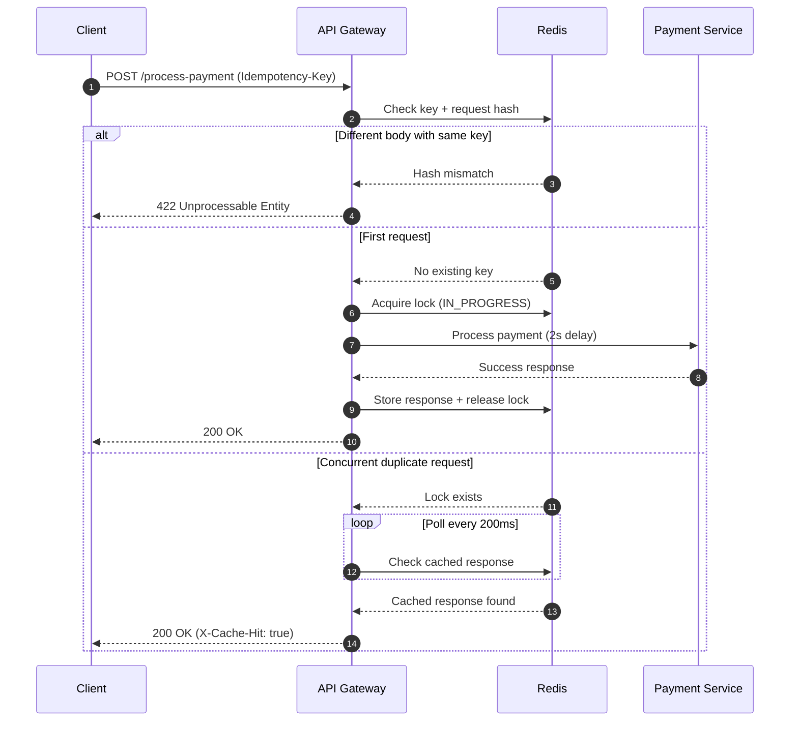

# FinSafe Idempotency Gateway (Pay-Once Protocol)

A backend system that prevents double-charging by enforcing request idempotency using Redis-based caching, locking, and request fingerprinting.

---

## 1. System Architecture Diagram

Below is the execution sequence flow illustrating how incoming initial requests, concurrent in-flight retries, and mismatched body fraud spikes are intercepted and processed.



## 2. Setup & Installation Instructions

Prerequisites

Node.js (v16+)
Docker Desktop (with Virtualization enabled)

## 1. Clone repository

```bash
git clone <your-repo-url>
cd Idempotency-Gateway
```

## 2. Install Dependencies:

```bash
npm install
```

## 3. Start Redis

```bash
docker run -d --name finsafe-redis -p 6379:6379 redis
```

## 4. Boot Up the Application Server:

```bash
node src/app.js
```

## 5. Run test suite

```bash
node tests/simulate-traffic.js
```

# 3. API Documentation

POST /process-payment

Processes a payment request with idempotency protection.

**Headers:**
Content-Type: application/json
Idempotency-Key: <UUID>

**Request Body**

```json
{
  "amount": 250.0,
  "currency": "GHS"
}
```

**Success Response (200 OK)**

```json
{
  "status": "SUCCESS",
  "message": "Charged 100 GHS",
  "processedAt": "2026-06-24T00:05:00.000Z"
}
```

**Cached Response (200 OK)**

Header:

X-Cache-Hit: true

Same body as original response.

**Invalid Reuse (422)**

Returned when same key is used with different payload.

```json
{
  "error": "Unprocessable Entity",
  "message": "Idempotency key already used for a different request body."
}
```

# 4. Design Decisions

# 4.1 Redis Locking

Uses SET key value NX EX
Prevents duplicate execution during concurrent requests
Ensures only one payment runs per key

# 4.2 Request Fingerprinting

SHA-256 hash of request body
Stored under meta:<idempotency-key>
Detects payload tampering or reuse conflicts

# 4.3 Response Caching

Final response stored under:
response:<key>
TTL-based expiry (default 24h)
Enables instant replay of duplicate requests

# 4.4 In-Flight Protection

Polling loop checks:
lock status
cached response
Prevents race condition double processing

# 4.5 Failure Safety

Locks expire automatically (TTL fallback)
Prevents deadlocks if process crashes

## 5. Validation Results

**Concurrent Request Test**

```bash
Request A
Duration: ~2000ms
Cache Hit: false

Request B (arrives during A execution)
Duration: ~1900ms
Cache Hit: true

Request C (after cache stored)
Duration: ~5–15ms
Cache Hit: true
```

## 6. Developer Choice: Security Enhancement

**Request Body Integrity Guard**

A SHA-256 fingerprint is generated from the request body.

**Purpose:**

Prevents reuse of an idempotency key for different financial actions
Blocks accidental or malicious payload changes
Protects ledger consistency in payment systems

**Behavior:**

##7. Summary

**This system guarantees:\*\***

Exactly-once payment execution
Safe retries under network failure
Race-condition protection
Fast cached responses for duplicates
Payload integrity validation
